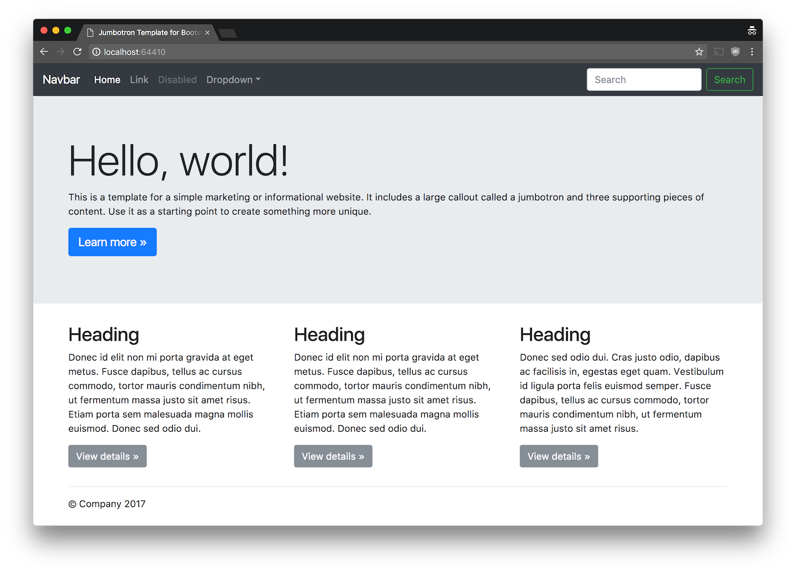

# Bootstrap Jumbotron

> Super simple Pingy scaffold for Bootstrap 4 beta jumbotron and SCSS

## How to use it

1. Install Pingy if you haven't already (Requires [Pingy CLI](https://github.com/pingyhq/pingy-cli) 0.10 or later).

```
npm install @pingy/cli --global
```

2. Create a folder for the new site that you want to scaffold and `cd` into it.

```
mkdir mysite && cd mysite
```

3. Scaffold your site

```
pingy scaffold bootstrap-jumbotron
```

4. Start up the pingy dev server and get to work. 💪

```
pingy dev
```



5. When you're happy that your site is just the right amount of awesome you can export it and it's ready to be uploaded wherever you like. ⚡️

```
pingy export
```

## By the way

This repo is designed to also work as a standalone site as well as a scaffold. So, you can also just clone this repo run `npm install` and then `npm start` if you like.
